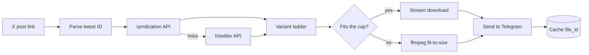

<p align="center">
  
</p>

<h1 align="center">justthefile</h1>

<p align="center">
  <strong>Paste an X (Twitter) link into a web page, or send it to a Telegram bot.<br>Get the video back as a real mp4.</strong>
</p>

<p align="center">
  No mirror page. No interstitial. No ads. Just the file.
</p>

<p align="center">
  No X API key. No developer account. No cookies. No login.
</p>

<p align="center">
  
  
  
  
  
  
</p>

<p align="center">
  <a href="https://justthefile.com"><strong>➜ justthefile.com</strong></a>
  &nbsp;·&nbsp;
  <a href="https://t.me/xwitter_downloader_bot"><strong>@xwitter_downloader_bot on Telegram</strong></a>
</p>

---

## Use it

**On the web**: open **[justthefile.com](https://justthefile.com)**, paste a link
to an X post, pick a quality. The file downloads straight from X's servers to your
browser. No 50 MB ceiling, and you get the original.

**On Telegram**: open **[@xwitter_downloader_bot](https://t.me/xwitter_downloader_bot)**,
hit **Start**, paste a link, get the video back as an mp4.

Either way: nothing to install, no account to make.

---

## What it does

| | |
|---|---|
| 🎬 | **Real mp4 files**, playable inline and saveable, not a link to a mirror site |
| 🖼️ | **Multi-video posts**, GIFs as looping animations, photos at original resolution |
| 🔗 | **`t.co` short links** resolved automatically |
| 📏 | **Smart size-fitting**: picks the best quality that fits Telegram's upload cap |
| ⚡ | **Instant repeats**: previously sent videos return from cache with zero re-download |
| 🎞️ | **Oversized videos still arrive**: compressed to fit, or as a direct link if compressing would ruin them |
| 🕵️ | **Nothing to sign up for**: no account, no login, no cookies. The cache records posts, never who asked for them |

---

## How it works



### Two extraction paths, because neither is enough alone

**`cdn.syndication.twimg.com/tweet-result`** is the endpoint behind embedded tweets.
It returns the **full variant ladder** (every mp4 bitrate X encoded), which is what
makes size-fitting possible. Card and amplify videos are absent from `mediaDetails`
and get recovered from `card.binding_values.unified_card`, a JSON string that has to
be decoded separately.

**`api.fxtwitter.com`** is the fallback for posts the first one drops, notably
age-restricted media. It returns a single URL per video, so anything resolved this
way loses the ladder.

`video.twimg.com` then serves the file with **no auth, no cookies and no Referer**,
and supports `HEAD` and range requests, which is what lets the bot check a file's
size before committing to the download.

### The real constraint is Telegram, not X

Bots may upload at most **50 MB**. So before downloading anything, the bot walks the
variant ladder top-down and `HEAD`s each rung until one fits: three cheap round
trips instead of a wasted multi-hundred-megabyte download.

Only when nothing fits does ffmpeg re-encode to a size target, dropping resolution
to match the bitrate budget rather than holding 720p at a bitrate that can't
support it. Videos too long to compress without ruining them get a direct link back
instead of a smeared mess.

### Don't trust the metadata

The APIs misreport dimensions: one test post advertises `1080x1080` while serving
`720x720`. Feeding Telegram the wrong numbers makes its inline player render the
video incorrectly, so every file is `ffprobe`d after download and before upload.

---

## The web front end


**The server never touches the video.** `/api/resolve` returns a few KB of JSON,
with every rendition labelled and sized, and the browser fetches the bytes straight
from X's CDN. That deletes the expensive half of the problem: no bandwidth cost,
no ffmpeg, no queue, no scratch disk. It is also *faster than the bot*, which has
to download a file and then upload it to Telegram before you see anything.

And because there's no Telegram, there's no 50 MB cap: the site offers the whole
ladder at full quality, including files the bot has to compress or refuse.

```bash
docker compose up -d          # bot + web
docker compose up -d bot      # bot only
curl localhost:8080/api/health
```

The port is bound to `127.0.0.1`, so put a TLS terminator in front of it.
Caddy with a two-line `reverse_proxy 127.0.0.1:8080` is the shortest route to a
correct certificate. Set `WEB_TRUST_PROXY=true` once you do, or the per-IP rate
limit will see every visitor as the proxy and throttle them as one; leave it off
until then, since `X-Forwarded-For` is attacker-controlled without something
in front to overwrite it.

### Two things the browser makes awkward

**`download` is ignored on cross-origin links.** A plain
`<a href="https://video.twimg.com/…" download="clip.mp4">` navigates to the video
and plays it rather than saving it, and the filename is discarded. The fix is to
read the response into a blob and point the link at the resulting `blob:` URL,
which *is* same-origin. That buys a real filename and a progress bar, at the cost
of holding the file in memory while it downloads, which is fine for the sizes X serves,
and the reason there's no server-side proxy here at all.

**`video.twimg.com` hotlink-protects on `Referer`.** It serves any request that
sends none, and `403`s any `Referer` that isn't `x.com`, while ignoring `Origin`
entirely, which is what makes the cross-origin fetch legal in the first place.
The download therefore sets `referrerPolicy: "no-referrer"` explicitly; the
browser's default would attach one and break every download.

---

## Notes

This relies on undocumented endpoints that can change without warning, hence the
two-provider fallback.

Downloaded video remains subject to whatever rights the original poster holds.
Intended for personal archiving of content you're entitled to keep.
