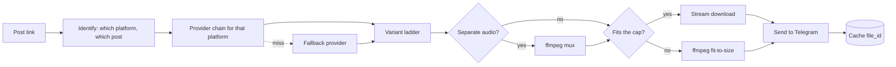
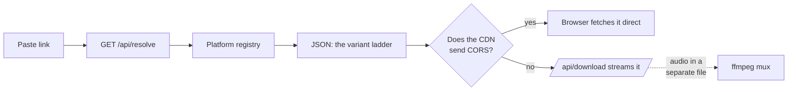

<p align="center">
  
</p>

<h1 align="center">justthefile</h1>

<p align="center">
  <strong>Paste an X or Reddit link into a web page, or send one to a Telegram bot.<br>Get the video back as a real mp4.</strong>
</p>

<p align="center">
  No mirror page. No interstitial. No ads. Just the file.
</p>

<p align="center">
  No API keys. No developer account. No cookies. No login.
</p>

<p align="center">
  
  
  
  
  
  
</p>

<p align="center">
  <a href="https://justthefile.com"><strong>➜ justthefile.com</strong></a>
  &nbsp;·&nbsp;
  <a href="https://t.me/xwitter_downloader_bot"><strong>@xwitter_downloader_bot</strong></a>
  &nbsp;·&nbsp;
  <a href="https://t.me/rddt_downloader_bot"><strong>@rddt_downloader_bot</strong></a>
</p>

---

## Use it

**On the web**: open **[justthefile.com](https://justthefile.com)**, paste a link
to an X or Reddit post, pick a quality. No 50 MB ceiling, and you get the
original. X files download straight from X's servers to your browser, so they
never touch this box at all.

**On Telegram**: one bot per platform, each with its own name and photo.
**[@xwitter_downloader_bot](https://t.me/xwitter_downloader_bot)** for X,
**[@rddt_downloader_bot](https://t.me/rddt_downloader_bot)** for Reddit. Hit
**Start**, paste a link, get the video back as an mp4 — with its audio track
joined back on, in Reddit's case.

Either way: nothing to install, no account to make.

---

## What it does

| | |
|---|---|
| 🎬 | **Real mp4 files**, playable inline and saveable, not a link to a mirror site |
| 🖼️ | **Multi-video posts**, GIFs as looping animations, photos at original resolution |
| 🔗 | **Short links** resolved automatically: `t.co`, `redd.it`, and Reddit's `/s/` share links |
| 🔊 | **Reddit video arrives with sound**, which DASH splits into a separate file and most tools drop |
| 📏 | **Smart size-fitting**: picks the best quality that fits Telegram's upload cap |
| ⚡ | **Instant repeats**: previously sent videos return from cache with zero re-download |
| 🎞️ | **Oversized videos still arrive**: compressed to fit, or as a direct link if compressing would ruin them |
| 🕵️ | **Nothing to sign up for**: no account, no login, no cookies. The cache records posts, never who asked for them |

---

## Supported platforms

| Platform | Links accepted | Web | Telegram bot |
|---|---|---|---|
| **X (Twitter)** | `x.com`, `twitter.com`, `t.co` | ✅ | ✅ `PLATFORM=x` |
| **Reddit** | `reddit.com`, `redd.it`, `/s/` share links | ✅ | ✅ `PLATFORM=reddit` |

Both surfaces resolve through the same platform registry in `core/platforms/`,
and neither names a platform in its own code. **The site is the aggregator**: one
page, every platform, chosen by whatever link you paste. **The bots are
standalones**: one bot per platform, each with its own token, name, photo and
cache, so a Reddit user is never handed X's copy or X's error messages.

They're the same process started twice. `PLATFORM` picks the handler out of the
registry and the copy out of `bot/profile.py`; everything between (queue,
size-fitting, transcode, `file_id` cache) is platform-blind and exists once.

Adding a platform is a new module in `core/platforms/` plus one entry in
`REGISTRY`. Nothing above that line names a platform: not the API, not the cache,
not the front end, which asks `/api/platforms` what it supports rather than
hardcoding a list. Giving it a bot too is a `Profile` in `bot/profile.py` and a
service block in `docker-compose.yml`.

---

## How it works

The pipeline below is the **Telegram bot's**. The site shares the extraction
half and diverges at delivery — see [The web front end](#the-web-front-end).

Only the two shaded steps differ by platform: which provider pair is asked, and
whether audio arrives as a second file that has to be joined on. The rest of the
pipeline never learns where the bytes came from.



### X: two extraction paths, because neither is enough alone

**`cdn.syndication.twimg.com/tweet-result`** is the endpoint behind embedded tweets.
It returns the **full variant ladder** (every mp4 bitrate X encoded), which is what
makes size-fitting possible. Card and amplify videos are absent from `mediaDetails`
and get recovered from `card.binding_values.unified_card`, a JSON string that has to
be decoded separately.

**`api.fxtwitter.com`** is the fallback for posts the first one drops, notably
age-restricted media. It returns a single URL per video, so anything resolved this
way loses the ladder.

`video.twimg.com` then serves the file with **no auth, no cookies and no Referer**,
and supports `HEAD` and range requests, which is what lets the bot check a file's
size before committing to the download.

### Reddit: the same split, for a different reason

Reddit lands on a two-provider pair as well, and the reliable source is the
scrape rather than the API.

**`old.reddit.com`** is the primary. The page is server-rendered and every field
worth having sits in `data-` attributes on the post's own div, so this is
attribute lookup rather than real HTML parsing. Those attributes have been stable
for the decade old.reddit has existed.

**Reddit's own post JSON** is the fallback, and it is cleaner data that cannot be
trusted first: across testing it returned `403` in bursts from a single IP with
no warning and no `Retry-After`, then recovered. For a site serving many visitors
from one VPS address that means failures that look random. The reliable source is
the HTML; the rich source is the JSON.

The variant ladder comes from neither. `v.redd.it` publishes a
**`DASHPlaylist.mpd`** next to every video listing each rendition it encoded,
needs no auth, and hasn't rate-limited in any testing: the post page says *which*
video, the manifest says what qualities exist.

The catch, and the reason Reddit can't be delivered the way X is: **audio lives
in its own AdaptationSet and its own file**. A video Representation on its own is
silent, which is why so many downloaders hand back mute clips.

### The real constraint is Telegram, not X

Bots may upload at most **50 MB**. So before downloading anything, the bot walks the
variant ladder top-down and `HEAD`s each rung until one fits: three cheap round
trips instead of a wasted multi-hundred-megabyte download.

Only when nothing fits does ffmpeg re-encode to a size target, dropping resolution
to match the bitrate budget rather than holding 720p at a bitrate that can't
support it. Videos too long to compress without ruining them get a direct link back
instead of a smeared mess.

### Don't trust the metadata

The APIs misreport dimensions: one test post advertises `1080x1080` while serving
`720x720`. Feeding Telegram the wrong numbers makes its inline player render the
video incorrectly, so every file is `ffprobe`d after download and before upload.

---

## The web front end



`/api/resolve` returns a few KB of JSON with every rendition labelled and sized.
Where the bytes come from next depends on the platform, and that is not a
preference: it is whatever its CDN permits.

**X costs nothing to serve.** `video.twimg.com` reflects arbitrary origins in
`Access-Control-Allow-Origin`, so the browser fetches the file itself and this
server never sees it. No bandwidth, no ffmpeg, no queue. It is also *faster than
the bot*, which has to download a file and then upload it to Telegram before you
see anything. And with no Telegram there is no 50 MB cap, so the site offers the
whole ladder at full quality, including files the bot has to compress or refuse.

**Reddit mostly cannot work that way**, which was found by measuring rather than
assuming:

| Media | CDN | Delivery | Why |
|---|---|---|---|
| Video, no audio track | `v.redd.it` | direct | Sends `ACAO: *`, file is complete |
| Video with audio | `v.redd.it` | proxy + mux | DASH keeps audio in its own file |
| Image or gallery | `i.redd.it` | proxy | Sends no CORS header at all |

Reddit's simplest media is the one a browser cannot fetch. So delivery is decided
per item, not per platform, and `/api/download` exists for the cases that need
this box in the path. Muxing copies both streams without re-encoding, so it costs
I/O rather than CPU.

That endpoint takes **indices, never URLs**. Every URL it touches is re-derived
from our own resolution of the post, and checked against the platform's declared
`MEDIA_HOSTS` before any fetch. Accepting a caller-supplied URL would make the
box an open proxy, which is worth more to an attacker than anything else here.

```bash
docker compose up -d               # both bots + web
docker compose up -d bot-reddit    # one bot only
curl localhost:8080/api/health
```

The port is bound to `127.0.0.1`, so put a TLS terminator in front of it.
Caddy with a two-line `reverse_proxy 127.0.0.1:8080` is the shortest route to a
correct certificate. Set `WEB_TRUST_PROXY=true` once you do, or the per-IP rate
limit will see every visitor as the proxy and throttle them as one; leave it off
until then, since `X-Forwarded-For` is attacker-controlled without something
in front to overwrite it.

### Two things the browser makes awkward

**`download` is ignored on cross-origin links.** A plain
`<a href="https://video.twimg.com/…" download="clip.mp4">` navigates to the video
and plays it rather than saving it, and the filename is discarded. The fix is to
read the response into a blob and point the link at the resulting `blob:` URL,
which *is* same-origin. That buys a real filename and a progress bar, at the cost
of holding the file in memory while it downloads, which is fine for the sizes X serves,
and the reason there's no server-side proxy here at all.

**`video.twimg.com` hotlink-protects on `Referer`.** It serves any request that
sends none, and `403`s any `Referer` that isn't `x.com`, while ignoring `Origin`
entirely, which is what makes the cross-origin fetch legal in the first place.
The download therefore sets `referrerPolicy: "no-referrer"` explicitly; the
browser's default would attach one and break every download.

---

## Notes

This relies on undocumented endpoints that can change without warning, which is
why every platform here resolves through two independent providers rather than
one.

Downloaded video remains subject to whatever rights the original poster holds.
Intended for personal archiving of content you're entitled to keep.
