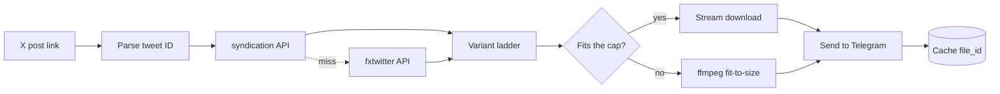

  

<h1 align="center">xwitter_downloader</h1>

  <strong>Send a Telegram bot an X (Twitter) link. Get the video back as a real mp4.</strong>

  No X API key. No developer account. No cookies. No login.

  
  
  
  
  
  

  <a href="https://t.me/xwitter_downloader_bot"><strong>➜ Open @xwitter_downloader_bot on Telegram</strong></a>

---

## Use it

1. Open **[@xwitter_downloader_bot](https://t.me/xwitter_downloader_bot)** and hit **Start**.
2. Paste a link to an X post.
3. Get the video back as an mp4.

That's the whole interface. Nothing to install, no account to make, no site to visit.

---

## What it does

| | |
|---|---|
| 🎬 | **Real mp4 files**, playable inline and saveable — not a link to a mirror site |
| 🖼️ | **Multi-video posts**, GIFs as looping animations, photos at original resolution |
| 🔗 | **`t.co` short links** resolved automatically |
| 📏 | **Smart size-fitting** — picks the best quality that fits Telegram's upload cap |
| ⚡ | **Instant repeats** — previously sent videos return from cache with zero re-download |
| 🎞️ | **Oversized videos still arrive** — compressed to fit, or as a direct link if compressing would ruin them |
| 🕵️ | **Nothing to sign up for** — no account, no login, no cookies. The cache records posts, never who asked for them |

---

## How it works

### Two extraction paths, because neither is enough alone

**`cdn.syndication.twimg.com/tweet-result`** is the endpoint behind embedded tweets.
It returns the **full variant ladder** — every mp4 bitrate X encoded — which is what
makes size-fitting possible. Card and amplify videos are absent from `mediaDetails`
and get recovered from `card.binding_values.unified_card`, a JSON string that has to
be decoded separately.

**`api.fxtwitter.com`** is the fallback for posts the first one drops, notably
age-restricted media. It returns a single URL per video, so anything resolved this
way loses the ladder.

`video.twimg.com` then serves the file with **no auth, no cookies and no Referer**,
and supports `HEAD` and range requests — which is what lets the bot check a file's
size before committing to the download.

### The real constraint is Telegram, not X

Bots may upload at most **50 MB**. So before downloading anything, the bot walks the
variant ladder top-down and `HEAD`s each rung until one fits — three cheap round
trips instead of a wasted multi-hundred-megabyte download.

Only when nothing fits does ffmpeg re-encode to a size target, dropping resolution
to match the bitrate budget rather than holding 720p at a bitrate that can't
support it. Videos too long to compress without ruining them get a direct link back
instead of a smeared mess.

### Don't trust the metadata

The APIs misreport dimensions — one test post advertises `1080x1080` while serving
`720x720`. Feeding Telegram the wrong numbers makes its inline player render the
video incorrectly, so every file is `ffprobe`d after download and before upload.

---

## Notes

This relies on undocumented endpoints that can change without warning — hence the
two-provider fallback.

Downloaded video remains subject to whatever rights the original poster holds.
Intended for personal archiving of content you're entitled to keep.
