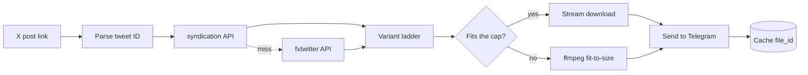

<h1 align="center">xwitter_downloader</h1>

<p align="center">
  <strong>Send a Telegram bot an X (Twitter) link. Get the video back as a real mp4.</strong>
</p>

<p align="center">
  No X API key. No developer account. No cookies. No login.
</p>

<p align="center">
  
  
  
  
  
  
</p>

---

## What it does

Paste a link, get the file. That's the whole interface.

| | |
|---|---|
| 🎬 | **Real mp4 files**, playable inline and saveable — not a link to a mirror site |
| 🖼️ | **Multi-video posts**, GIFs as looping animations, photos at original resolution |
| 🔗 | **`t.co` short links** resolved automatically |
| 📏 | **Smart size-fitting** — picks the best quality that fits Telegram's upload cap |
| ⚡ | **Instant repeats** — previously sent videos return from cache with zero re-download |
| 🔒 | **Private by default** — allowlisted users only; opening it up is one env var |
| 🐳 | **One-command deploy** — Docker Compose, no inbound ports, no domain, no TLS |

---

## How it works



### Two extraction paths, because neither is enough alone

**`cdn.syndication.twimg.com/tweet-result`** is the endpoint behind embedded tweets.
It returns the **full variant ladder** — every mp4 bitrate X encoded — which is what
makes size-fitting possible. Card and amplify videos are absent from `mediaDetails`
and get recovered from `card.binding_values.unified_card`, a JSON string that has to
be decoded separately.

**`api.fxtwitter.com`** is the fallback for posts the first one drops, notably
age-restricted media. It returns a single URL per video, so anything resolved this
way loses the ladder.

`video.twimg.com` then serves the file with **no auth, no cookies and no Referer**,
and supports `HEAD` and range requests — which is what lets the bot check a file's
size before committing to the download.

### The real constraint is Telegram, not X

Bots may upload at most **50 MB**. So before downloading anything, the bot walks the
variant ladder top-down and `HEAD`s each rung until one fits — three cheap round
trips instead of a wasted multi-hundred-megabyte download.

Only when nothing fits does ffmpeg re-encode to a size target, dropping resolution
to match the bitrate budget rather than holding 720p at a bitrate that can't
support it. Videos too long to compress without ruining them get a direct link back
instead of a smeared mess.

### Don't trust the metadata

The APIs misreport dimensions — one test post advertises `1080x1080` while serving
`720x720`. Feeding Telegram the wrong numbers makes its inline player render the
video incorrectly, so every file is `ffprobe`d after download and before upload.

---

## Quick start

**1. Create your bot.** Message [@BotFather](https://t.me/BotFather) → `/newbot` →
keep the token. Get your numeric user ID from [@userinfobot](https://t.me/userinfobot).

Name, photo and the rest of the profile: **[docs/BOTFATHER.md](docs/BOTFATHER.md)**.
Only the display name and photo are ever typed into BotFather — the blurbs and
command menu live in `bot/profile.py` and get pushed on every startup.

**2. Configure.** Clone the repo and drop a `.env` next to `docker-compose.yml`:

```bash
git clone <this-repo> && cd xwitter_downloader

cat > .env <<'EOF'
TELEGRAM_BOT_TOKEN=paste-your-token-here
ACCESS_MODE=private
ALLOWED_USER_IDS=your-numeric-user-id
EOF
```

Those three are all you need; everything else in [Configuration](#configuration)
has a working default. `.env` is gitignored and holds the only secret in the
project — never commit it.

**3. Run.**

```bash
docker compose up -d --build
docker compose logs -f
```

You're looking for `running as @your_bot_name in private mode`. Send it a link.

---

## Configuration

| Variable | Default | Purpose |
|---|---|---|
| `TELEGRAM_BOT_TOKEN` | — | From BotFather. **Required.** |
| `ACCESS_MODE` | `private` | `private`, `allowlist`, or `public` |
| `ALLOWED_USER_IDS` | — | Comma-separated. Required unless public |
| `BLOCKED_USER_IDS` | — | Always denied, even in public mode |
| `MAX_UPLOAD_MB` | `49` | Headroom under Telegram's 50 MB cap |
| `MAX_CONCURRENT_DOWNLOADS` | `3` | Network-bound; can overlap |
| `MAX_CONCURRENT_TRANSCODES` | `1` | CPU-bound. Keep at 1 on a small VPS |
| `MAX_QUEUE_PER_USER` | `5` | Per-user queue depth |
| `CACHE_DB` | `/data/cache.sqlite` | `file_id` cache. Persist this |
| `TMP_DIR` | `/tmp/xdl` | Scratch space for downloads/transcodes |

### Going public

Private by default. Opening it to everyone is `ACCESS_MODE=public` — a config
change, not a rewrite, because handlers enqueue work rather than doing it inline.
Concurrency is bounded by the semaphores above; tighten them before flipping.

Rate limiting, an egress counter and a disk guard are deliberately unbuilt. All
three belong in `bot/jobs.py` and need no changes to the extraction pipeline.

---

## Architecture

```
bot/
├── config.py       env-driven config, validated at startup
├── access.py       one is_allowed() gate
├── urls.py         URL -> tweet ID, t.co resolution
├── models.py       normalized Variant / MediaItem / TweetMedia
├── providers/      syndication (primary) + fxtwitter (fallback)
├── select.py       HEAD size probe, ladder walk, streaming download
├── transcode.py    ffprobe metadata + ffmpeg fit-to-size
├── cache.py        file_id cache (SQLite)
├── jobs.py         bounded queue + worker pool
├── profile.py      user-facing copy + command menu, synced at startup
└── main.py         handlers and wiring

assets/            logo source (SVG) + the 512px PNG BotFather wants
```

Three design choices worth knowing about:

- **Handlers never do work.** They enqueue a job; a bounded worker pool drains it.
  Downloads and transcodes have separate limits because they contend for different
  resources.
- **Uploads are cached by `file_id`.** Re-sending one is instant and costs no egress
  and no CPU.
- **Long-polling, not webhooks.** Outbound-only, so there's no public endpoint, no
  TLS certificate and no domain to maintain.

---

## Running it on a server

Anything that runs Docker will do. The bot long-polls, so there's no inbound port
to open, no domain and no TLS certificate to manage — `docker compose up -d --build`
is the whole deployment.

What a host needs:

- **1 GB RAM.** Measured: the bot idles at 38 MB, ffmpeg peaks at 132 MB; ~380 MB
  at peak with the OS and Docker daemon.
- **≥ 10 GB disk**, for Ubuntu plus the ffmpeg-laden image.
- **IPv4.** `cdn.syndication.twimg.com` publishes no IPv6 record, so an IPv6-only
  host silently loses the primary extraction path.
- **Any bandwidth.** Roughly 5–12 GB/month for personal use.

A 1 GB / 1 vCPU VPS at the usual budget providers is comfortably enough.

---

## Notes

This relies on undocumented endpoints that can change without warning — hence the
two-provider fallback.

Downloaded video remains subject to whatever rights the original poster holds.
Intended for personal archiving of content you're entitled to keep.
